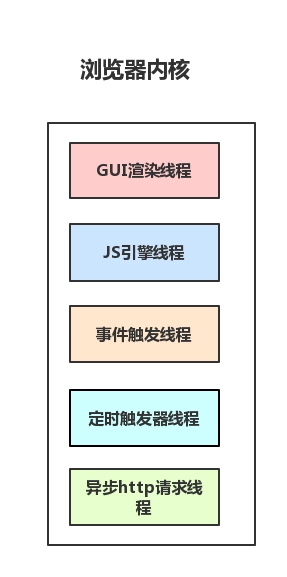
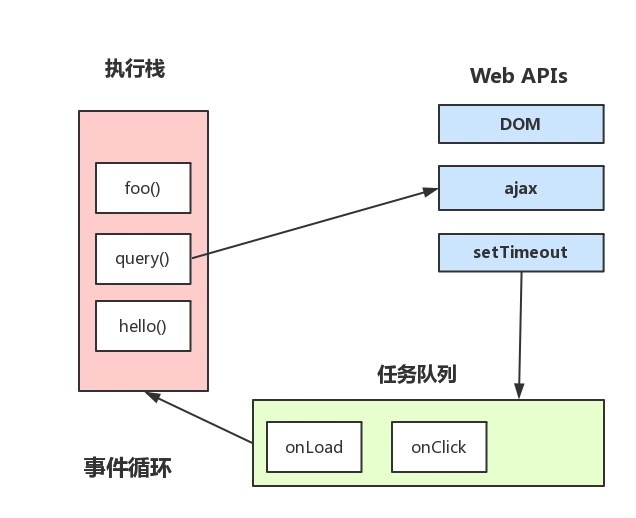
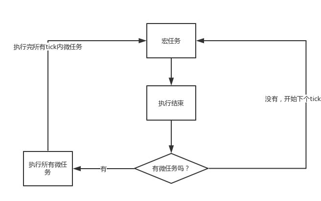

#### Javascript 进阶|this 解析

```
- 什么是事件循环
- “同步”、“异步” 和 “并行”
- 什么是 macro-task 宏观任务
- 什么是 macro-task 宏观任务
```

##### 什么是事件循环
JavaScript 提供了一种机制来处理程序中多个块的执行，且执行每块时调用 JavaScript 引擎，这种机制被称为事件循环

JavaScript 的一大特点就是单线程，而这个线程中拥有唯一的一个事件循环。

事件循环的顺序，决定了 JavaScript 代码的执行顺序。它从 script(整体代码) 开始第一次循环。之后全局上下文进入函数调用栈。直到调用栈清空 (只剩全局)，然后执行所有的 micro-task。当所有可执行的 micro-task 执行完毕之后。循环再次从 macro-task 开始，找到其中一个任务队列执行完毕，然后再执行所有的 micro-task，这样一直循环下去。

这样的唯一的一个事件循环 , 跟我们人的处理方式就有的相似了。 我们做一个项目时，有时需要让他人做一件事情，他人做完了可以发一条信息给我们，我们有空时可以查看； 有时我们遇到困难的事情的时候，会把它放到后面处理！

在 javascript 中， 也有类似的机制，它通过一些关键字来告诉系统，我是要让他人做事还是放到后面做。

他人做事 , 我们叫做 macro-task 宏观任务

放到后面做 , 我们叫做 macro-task 宏观任务

用一个翻译一本书的例子做解释， 大家共同翻译一本书： 
1、我（宏观任务）负责分析工作量并负责分配任务给其他人（其它宏观任务），我把自己翻译的章节自己做的放在后面去做（微观任务），我做完现在的分析工作先（宏观任务）； 
2、分析工作 (宏观任务) 完成了，我可以专注于翻译工作了（微观任务）， 如果翻译当前章节觉得烦，我再把它放到后面去做（微任务），先做其它的（微任务），直到所有翻译工作（微任务）完成；
3、我当前的分配（宏观任务）和翻译工作（微观任务）完成了， 有空去等其它人翻译是不是完成工作，然后告诉我，我开始做（宏观工作）

看看例子的实现
``` javascript
// 先来看输出结果：

// 共同翻译一本书 ==> 宏观任务开始
// 分析工作量找到有 6 章
// 1 章：A 翻译
// 2 章：我负责翻译
// 3 章：B 翻译
// 4 章：我负责翻译
// 5 章：C 翻译
// 6 章：我负责翻译
// 务分析完成 ==> 宏观任务结束
// => 微观任务开始
// 译任务在进行中
// 翻译第 2 章中
// 翻译第 2 章有点烦，我先翻译其它章再回来 
// => 我翻译第 2 章其它任务（微任务）放到后面
// 第 4 章翻译完
// 翻译第 6 章有点烦，我先翻译其它章再回来
// => 我翻译第 6 章其它任务（微任务）放到后面
// 翻译第 2 章 完成
// 翻译第 6 章有点烦，没有其它可以翻译了，我休息一会儿
// => 我翻译第 6 章其它任务（微任务）放到后面
// 翻译第 6 章 完成
// 负责的所有翻译完成了， 有空处理看看其它人翻译情况了
// => 微观任务结束
// 翻译第 5 章 完成 ==> 宏观任务开始
// 整合 翻译第 5 章 完成
// ==> 宏观任务结束
// 翻译第 3 章 完成 ==> 宏观任务开始
// 整合 翻译第 3 章 完成
// ==> 宏观任务结束
// 翻译第 1 章 完成 ==> 宏观任务开始
// 整合 翻译第 1 章 完成
// 译完成
// ==> 宏观任务结束

console.log(" 共同翻译一本书 ==> 宏观任务开始 ")

console.log(" 我分析工作量找到有 6 章 ")

var finishStatus = [0, 0, 0, 0, 0, 0]
// a 翻译第 1 章

console.log(" 第 1 章：A 翻译 ")
setTimeout(function () {
    console.log('A 翻译第 1 章 完成 ==> 宏观任务开始 ')
    finishStatus[0] = 1
    console.log(' 我整合 翻译第 1 章 完成 ')
    if (finishStatus.indexOf(0) == -1) {
        console.log(' 翻译完成 ')
    }
    console.log(" ==> 宏观任务结束 ")
}, 5000)


new Promise(function (resolve) {
    console.log(' 第 2 章：我负责翻译 ')

    resolve()
}).then(function () {
    new Promise(function (resolve) {

        console.log("==> 微观任务开始 ")
        console.log(" 翻译任务在进行中 ")
        console.log(' 我翻译第 2 章中 ')
        console.log(' 我翻译第 2 章有点烦，我先翻译其它章再回来 ')
        console.log('==> 我翻译第 2 章其它任务（微任务）放到后面 ')
        resolve()
    }).then(function () {
        finishStatus[1] = 1
        console.log(' 我 翻译第 2 章 完成 ')
    })
})

// b 翻译第 3 章
console.log(" 第 3 章：B 翻译 ")
setTimeout(function () {
    console.log('B 翻译第 3 章 完成 ==> 宏观任务开始 ')
    finishStatus[2] = 1
    console.log(' 我整合 翻译第 3 章 完成 ')
    if (finishStatus.indexOf(0) == -1) {
        console.log(' 翻译完成 ')
    }
    console.log(" ==> 宏观任务结束 ")
}, 3000)

new Promise(function (resolve) {
    console.log(' 第 4 章：我负责翻译 ')

    resolve()
}).then(function () {
    new Promise(function (resolve) {
        console.log(' 我第 4 章翻译完 ')
        finishStatus[3] = 1
    })
})

// c 翻译第 5 章
console.log(" 第 5 章：C 翻译 ")
setTimeout(function () {
    console.log('C 翻译第 5 章 完成 ==> 宏观任务开始 ')
    finishStatus[4] = 1
    console.log(' 我整合 翻译第 5 章 完成 ')
    if (finishStatus.indexOf(0) == -1) {
        console.log(' 翻译完成 ')
    }
    console.log(" ==> 宏观任务结束 ")
}, 0)

async function charter6() {
    await Dcharter6start()
    await Dcharter6doing1()
    await Dcharter6doing2()
    await Dcharter6finish()
}
charter6()

async function Dcharter6start() {
    console.log(' 第 6 章：我负责翻译 ')
}
async function Dcharter6doing1() {
    console.log(' 我翻译第 6 章有点烦，我先翻译其它章再回来 ')

    console.log('==> 我翻译第 6 章其它任务（微任务）放到后面 ')
}
async function Dcharter6doing2() {
    console.log(' 我翻译第 6 章有点烦，没有其它可以翻译了，我休息一会儿 ')
    console.log('==> 我翻译第 6 章其它任务（微任务）放到后面 ')
}
async function Dcharter6finish() {
    console.log(' 我 翻译第 6 章 完成 ')

    finishStatus[5] = 1
    console.log(' 我负责的所有翻译完成了， 有空处理看看其它人翻译情况了 ')
    console.log("==> 微观任务结束 ")
}


console.log(" 任务分析完成 ==> 宏观任务结束 ")
```

##### “同步”、“异步” 和 “并行”

我相信咱们经常听到一些术语 “同步”、“异步” 和 “并行”， 并且术语 “异步” 和 “并行” 常常被混为一谈，但实际上它们的意义完全不同。记住，
同步： 现在运行
异步： 将来运行，
并行： 同时发生的事情。

JavaScript 的一大特点就是单线程，而这个线程中拥有唯一的一个事件循环。所以 Javascript 中运行的代码不是同步就是异步的代码，但是不是咱们不用理会并行？ 当然是不是的，事实上 macro-task 宏观任务 ajax 向外出去的 的请求就是同步的，而如果有两个请求出去的时候，我们的不知道哪个先回来的！

例子

``` javascript

// 块 1
var a = 1;
// 块 1 完

// 块 2
function foo() {
    a = a + 1
}

// 块 3
function bar() {
    a = a * a
}


// ajax(..) 是某个库中提供的某个 Ajax 函数 
ajax( "http://some.url.1", foo );
ajax( "http://some.url.2", bar );

// 其它同步操作
```

同步操作的会先执行了， 异步操作会等到两个 url 请求返回来才执行；访问的 url 同时是对其自身做着并行操作，但是我们是不知道它们两哪个先访问完的， 而这样就要机会让我们每次访问的结果是不一样的， 这个就需要注意了。

譬如 url1 先完成，那先执行 `a = a + 1`  => `1 + 1 = 2`, 再 `a = a * a` => `2 * 2 = 4`

url2 先完成，那先执行 `a = a * a`  => `1 * 1 = 1`, 再 `a = a + a` => `1 + 1 = 2`

这种 foo 和 bar 不知道谁先执行的状态，也叫竞态条件， 当然如果 foo 和 bar 没有使用同样的 a，那他们就不存在竞态条件了

##### macro-task 宏观任务

常见的 macro-task 宏观任务有： setTimeout 、 setInterval、script、I/O 操作、UI 渲染、ajax
script(整体代码), setTimeout, setInterval, setImmediate, I/O, UI rendering。

事件循环 , 一旦有事件需要运行，事件循环就会运行，macro-task 宏观任务命令返回来的任务都会放到队列中，一个宏观任务会被叫做 tick ， tick 所有完成才会去做其它的 tick， 直到队列清空。

事实上 ， 我们说的 JavaScript 的一大特点就是单线程 , 说的是`JS 引擎`是单线程的 ,  而浏览器是多进程的，浏览器每一个 tab 标签都代表一个独立的进程（也不一定，因为多个空白 tab 标签会合并成一个进程），浏览器内核（浏览器渲染进程）属于浏览器多进程中的一种。



macro-task 宏观任务基本上就是提交一个并行的事件，而如果这个事件完成了就在 JS 引擎单线程的队列中加一个任务，并等待 JS 引擎在执行栈中处理完


##### micro-task 微观任务

常见的 micro-task 微观任务有：process.nextTick、Object.observe、MutationObserver、promise 的 then 回调函数、async 函数里面第二个 await 表达式后面的代码。

在每个 tick 中选择最先进入队列的同步宏任务的执行，执行完后，会检查是否存在 Microtasks(当前 tick 的异步操作) ，如果存在则不停地执行，直至清空微观任务队列



参考

- https://segmentfault.com/a/1190000015559210
- https://www.cnblogs.com/yugege/p/9598265.html
- https://www.youtube.com/watch?v=8aGhZQkoFbQ
- 《你不知道的 Javascript 中》
