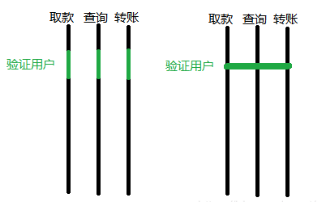

#### Javascript 进阶|高阶函数

场景

假设你现在有一个牛逼的日历弹窗，有一天，老板让你统计一下每天这个弹窗里面某个按钮的点击数，于是你在弹窗里做了埋点；

过了一个星期，老板说用户反馈这个弹窗好慢，各种卡顿。你想看一下某个函数的平均执行时间，于是你又在弹窗里加上了性能统计代码。

时间久了，你会发现你的业务逻辑里包含了大量的和业务无关的东西，即使是一些你已经封装过的函数。

那么 AOP 就是为了解决这类问题而存在的。

什么是AOP？

我们聚焦的永远是我们的目标，我需要喝水，水就是我们的目标，而水的质量好坏不应该让我喝水这件事情变得复杂，它应该由相关的机构去完成，在我喝水之前

检测水是否可以饮用是一个很重要的环节，但是并不是我应该重点关注的问题，如果每一次我需要购买水喝，都先拿着水去检测一遍，是不是让我们原本要做的事情变得很复杂呢？而且仔细想一下，检测水质量这件事，是不是可以批量呢？如果有个相关机构在将水售卖前批量去质检，是不是比我们每个人拿着水去相关单位检查更有效率呢？

我们项目也有很多业务也和上面一样的情况，比如安全、事务、日志等等，这些不是主线的事情与并不应该让我们原本要做的事情变得复杂。

所以我们相关机构切入到我们的行动中的这种思想就是面向切面的思想。

AOP是对OOP的一个横向的补充，AOP(面向切面编程)的主要作用是把一些跟核心业务逻辑模块无关的功能抽离出来，这些跟业务逻辑无关的功能通常包括日志统计、安全控制、异常处理等。把这些功能抽离出来之后， 再通过“动态织入”的方式掺入业务逻辑模块中。

AOP 的本质是在一系列的纵向的控制流程中，把那些相同的子流程提取成一个横向的面，把纵向流程画成一条直线，而 AOP 相当于把相同的地方连起来了

举个例子：银行系统取款、查询、转账前都需要验证用户。 验证用户这个子流程就成了一条直线，也可以理解成一个切面，这里只插了三个流程取款、查询、转账，如果其他流程也需要这个子流程，也可以插到其他地方去。

AOP能给我们带来什么好处？

AOP的好处首先是可以保持业务逻辑模块的纯净和高内聚性，其次是可以很方便地复用日志统计等功能模块。 

AOP术语

| 术语   | 说明                                                                                                                                                                                             |
| ------ | ------------------------------------------------------------------------------------------------------------------------------------------------------------------------------------------------ |
| 切面   | 切面泛指交叉业务逻辑。比如事物处理，日志处理就可以理解为切面。常用的切面有通知与顾问。实际就是对主业务逻辑的一种增强                                                                             |
| 织入   | 织入是指将切面代码插入到目标对象的过程                                                                                                                                                           |
| 连接点 | 连接点指切面可以织入的位置                                                                                                                                                                       |
| 切入点 | 切入点指切面具体织入的位置                                                                                                                                                                       |
| 通知   | 通知（Advice）是切面的一种实现，可以完成简单织入功能（织入功能就是在这里完成的）。通知定义了增强代码切入到目标代码的时间点，是目标方法执行之前执行，还是之后执行等。通知类型不同，切入时间不同。 |
| 顾问   | 顾问（Advisor）是切面的另一种实现，能够将通知以更为复杂的方式织入到目标对象中，是将通知包装为更复杂切面的装配器。不仅指定了切入时间点，还可以指定具体的切入点。                                  |

AOP的实现方式
| 通知类型                         | 说明                                       |
| -------------------------------- | ------------------------------------------ |
| 前置通知（MethodBeforeAdvice)    | 目标方法执行之前调用                       |
| 后置通知（AfterReturningAdvice） | 目标方法执行完成之后调用                   |
| 环绕通知（MethodInterceptor）    | 目标方法执行前后都会调用方法，且能增强结果 |
| 异常处理通知（ThrowsAdvice）     | 目标方法出现异常调用                       |

参考：
- https://www.jianshu.com/p/e6121f2280fa
- https://blog.csdn.net/qq_42539533/article/details/90551738
- https://blog.51cto.com/14150615/2354123
- https://blog.csdn.net/zero_person_xianzi/article/details/99618377
- https://www.jb51.net/article/160338.htm