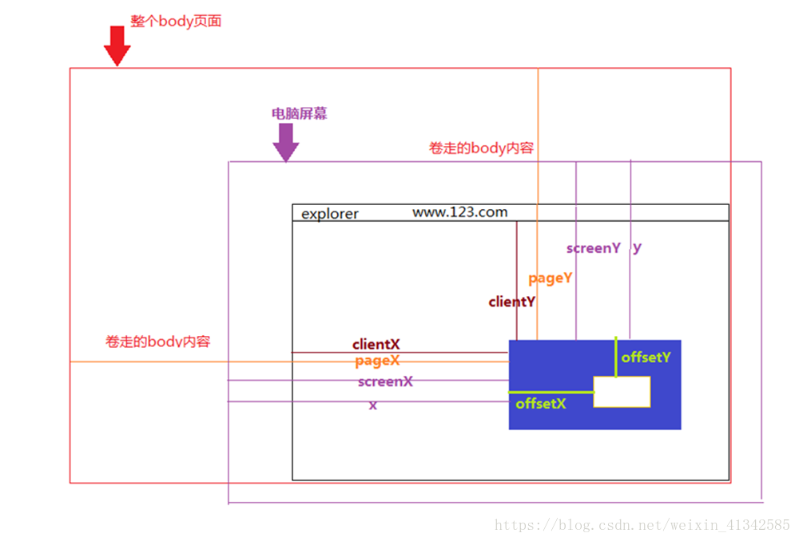

#### Javascript|鼠标事件以及clientX、offsetX、screenX、pageX、x的区别
鼠标事件
鼠标事件有下面这几种：

1. onclick
鼠标点击事件

box.onclick = function(e){
    console.log(e)
}

2. onmousedown
鼠标按下事件

box.onmousedown = function(e){
    console.log(e)
}

3. onmouseup
鼠标松开事件

box.onmouseup = function(e){
    console.log(e)
}

4. onmousemove
鼠标移动事件

box.onmousemove = function(e){
    console.log(e)
}

5. onmouseover
鼠标经过事件

box.onmouseover = function(e){
    console.log(e)
}

6. onmouseout
鼠标划出事件

box.onmouseout = function(e){
    console.log(e)
}

由鼠标事件（MouseEvent）可以发现：

其中包含了许多的坐标，且每个坐标的含义都不一样。下面我们来挨个介绍常用的坐标，以及它们的含义。

一、clientX、clientY
点击位置距离当前body可视区域的x，y坐标

二、pageX、pageY
对于整个页面来说，包括了被卷去的body部分的长度

三、screenX、screenY
点击位置距离当前电脑屏幕的x，y坐标

四、offsetX、offsetY
相对于带有定位的父盒子的x，y坐标

五、x、y
和screenX、screenY一样

如图所示：

原文链接：https://blog.csdn.net/weixin_41342585/article/details/80659736

---
> 桥智科技：科技赋能梦想！专注广州、深圳和惠州小程序定制开发、APP 应用定制开发、网站开发、区块链钱包开发！